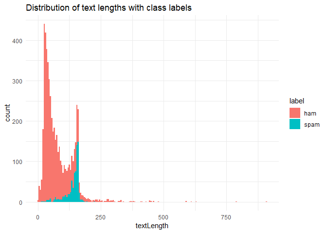

## R Markdown

This is an R Markdown document. Markdown is a simple formatting syntax for authoring HTML, PDF, and MS Word documents. For more details on using R Markdown see <http://rmarkdown.rstudio.com>.

When you click the **Knit** button a document will be generated that includes both content as well as the output of any embedded R code chunks within the document. You can embed an R code chunk like this:


```r
spam.raw <- read.csv("spam.csv", stringsAsFactors = FALSE)
spam.raw <- spam.raw[, 1:2]

names(spam.raw) <- c("label", "text")
head(spam.raw)
```

```
##   label
## 1   ham
## 2   ham
## 3  spam
## 4   ham
## 5   ham
## 6  spam
##                                                                                                                                                          text
## 1                                             Go until jurong point, crazy.. Available only in bugis n great world la e buffet... Cine there got amore wat...
## 2                                                                                                                               Ok lar... Joking wif u oni...
## 3 Free entry in 2 a wkly comp to win FA Cup final tkts 21st May 2005. Text FA to 87121 to receive entry question(std txt rate)T&C's apply 08452810075over18's
## 4                                                                                                           U dun say so early hor... U c already then say...
## 5                                                                                               Nah I don't think he goes to usf, he lives around here though
## 6        FreeMsg Hey there darling it's been 3 week's now and no word back! I'd like some fun you up for it still? Tb ok! XxX std chgs to send, å£1.50 to rcv
```

## Check if incomplete values

check if any NA value


```r
length(which(!complete.cases(spam.raw)))
```

```
## [1] 0
```

## Explore Data


```r
spam.raw$label <- as.factor(spam.raw$label)
base::table(spam.raw$label)
```

```
## 
##  ham spam 
## 4825  747
```

```r
prop.table(base::table(spam.raw$label))
```

```
## 
##       ham      spam 
## 0.8659368 0.1340632
```


### Add length of text


```r
spam.raw$textLength <- nchar(spam.raw$text)
head(spam.raw)
```

```
##   label
## 1   ham
## 2   ham
## 3  spam
## 4   ham
## 5   ham
## 6  spam
##                                                                                                                                                          text
## 1                                             Go until jurong point, crazy.. Available only in bugis n great world la e buffet... Cine there got amore wat...
## 2                                                                                                                               Ok lar... Joking wif u oni...
## 3 Free entry in 2 a wkly comp to win FA Cup final tkts 21st May 2005. Text FA to 87121 to receive entry question(std txt rate)T&C's apply 08452810075over18's
## 4                                                                                                           U dun say so early hor... U c already then say...
## 5                                                                                               Nah I don't think he goes to usf, he lives around here though
## 6        FreeMsg Hey there darling it's been 3 week's now and no word back! I'd like some fun you up for it still? Tb ok! XxX std chgs to send, å£1.50 to rcv
##   textLength
## 1        111
## 2         29
## 3        155
## 4         49
## 5         61
## 6        148
```

```r
summary(spam.raw$textLength)
```

```
##    Min. 1st Qu.  Median    Mean 3rd Qu.    Max. 
##    2.00   36.00   61.00   80.12  121.00  910.00
```


### draw a histogram of label by size


```r
library(ggplot2)
```

```
## Warning: package 'ggplot2' was built under R version 3.5.1
```

```r
ggplot(spam.raw, aes(x=textLength, fill=label)) +
  theme_minimal() +
  geom_histogram( binwidth = 5) +
  labs(title = "Distribution of text lengths with class labels")
```

<!-- -->

### Split Data in training set and test set

    Use caret package
    
Use the caret package

```r
library(caret)
```

```
## Warning: package 'caret' was built under R version 3.5.1
```

```
## Loading required package: lattice
```

```r
# help(package="caret")

set.seed(32984)
indexes <- createDataPartition(spam.raw$label, times = 1,
                               p = 0.7, list = FALSE)
train <- spam.raw[indexes,]
test <- spam.raw[-indexes,]

table(train$label)
```

```
## 
##  ham spam 
## 3378  523
```

```r
prop.table(table(train$label))
```

```
## 
##       ham      spam 
## 0.8659318 0.1340682
```

```r
table(test$label)
```

```
## 
##  ham spam 
## 1447  224
```

```r
prop.table(table(test$label))
```

```
## 
##       ham      spam 
## 0.8659485 0.1340515
```


### Text pre-processing

    tokenization
    lowercase
    remove stopwords
    stemming


```r
library(quanteda)
```

```
## Warning: package 'quanteda' was built under R version 3.5.1
```

```
## Package version: 1.3.14
```

```
## Parallel computing: 2 of 8 threads used.
```

```
## See https://quanteda.io for tutorials and examples.
```

```
## 
## Attaching package: 'quanteda'
```

```
## The following object is masked from 'package:utils':
## 
##     View
```

```r
train.tokens <- tokens(train$text, what = "word",
                       remove_numbers = TRUE, remove_punct = TRUE,
                       remove_symbols = TRUE, remove_hyphens = TRUE)
train$text[357]
```

```
## [1] "Your credits have been topped up for http://www.bubbletext.com Your renewal Pin is tgxxrz"
```

```r
train.tokens[[357]]
```

```
##  [1] "Your"               "credits"            "have"              
##  [4] "been"               "topped"             "up"                
##  [7] "for"                "http"               "www.bubbletext.com"
## [10] "Your"               "renewal"            "Pin"               
## [13] "is"                 "tgxxrz"
```

```r
train.tokens <-  tokens_tolower(train.tokens)
train.tokens[[357]]
```

```
##  [1] "your"               "credits"            "have"              
##  [4] "been"               "topped"             "up"                
##  [7] "for"                "http"               "www.bubbletext.com"
## [10] "your"               "renewal"            "pin"               
## [13] "is"                 "tgxxrz"
```

```r
train.tokens <- tokens_select(train.tokens, stopwords(language = "english"),
                              selection = "remove")
train.tokens[[357]]
```

```
## [1] "credits"            "topped"             "http"              
## [4] "www.bubbletext.com" "renewal"            "pin"               
## [7] "tgxxrz"
```

```r
train.tokens <- tokens_wordstem(train.tokens, language = "english")
train.tokens[[357]]
```

```
## [1] "credit"             "top"                "http"              
## [4] "www.bubbletext.com" "renew"              "pin"               
## [7] "tgxxrz"
```


### Create Document Frequency Matrix


```r
train.tokens.dfm <- dfm(train.tokens, tolower = FALSE)
train.tokens.matrix <- as.matrix(train.tokens.dfm)
head(train.tokens.matrix[1:6, 1:50])
```

```
##        features
## docs    go jurong point crazi avail bugi n great world la e buffet cine
##   text1  1      1     1     1     1    1 1     1     1  1 1      1    1
##   text2  0      0     0     0     0    0 0     0     0  0 0      0    0
##   text3  0      0     0     0     0    0 0     0     0  0 0      0    0
##   text4  0      0     0     0     0    0 0     0     0  0 0      0    0
##   text5  0      0     0     0     0    0 0     0     0  0 0      0    0
##   text6  0      0     0     0     0    0 0     0     0  0 0      0    0
##        features
## docs    got amor wat u dun say earli hor c alreadi nah think goe usf live
##   text1   1    1   1 0   0   0     0   0 0       0   0     0   0   0    0
##   text2   0    0   0 2   1   2     1   1 1       1   0     0   0   0    0
##   text3   0    0   0 0   0   0     0   0 0       0   1     1   1   1    1
##   text4   0    0   0 0   0   0     0   0 0       0   0     0   0   0    0
##   text5   0    0   0 0   0   0     0   0 0       0   0     0   0   0    0
##   text6   0    0   0 1   0   0     0   0 0       0   0     0   0   0    0
##        features
## docs    around though freemsg hey darl week now word back like fun still
##   text1      0      0       0   0    0    0   0    0    0    0   0     0
##   text2      0      0       0   0    0    0   0    0    0    0   0     0
##   text3      1      1       0   0    0    0   0    0    0    0   0     0
##   text4      0      0       1   1    1    1   1    1    1    1   1     1
##   text5      0      0       0   0    0    0   0    0    0    0   0     0
##   text6      0      0       0   0    0    0   0    0    0    0   0     0
##        features
## docs    tb ok xxx std chgs send å rcv winner valu
##   text1  0  0   0   0    0    0 0   0      0    0
##   text2  0  0   0   0    0    0 0   0      0    0
##   text3  0  0   0   0    0    0 0   0      0    0
##   text4  1  1   1   1    1    1 1   1      0    0
##   text5  0  0   0   0    0    0 1   0      1    1
##   text6  0  0   0   0    0    0 0   0      0    0
```

```r
dim(train.tokens.matrix)
```

```
## [1] 3901 5742
```

